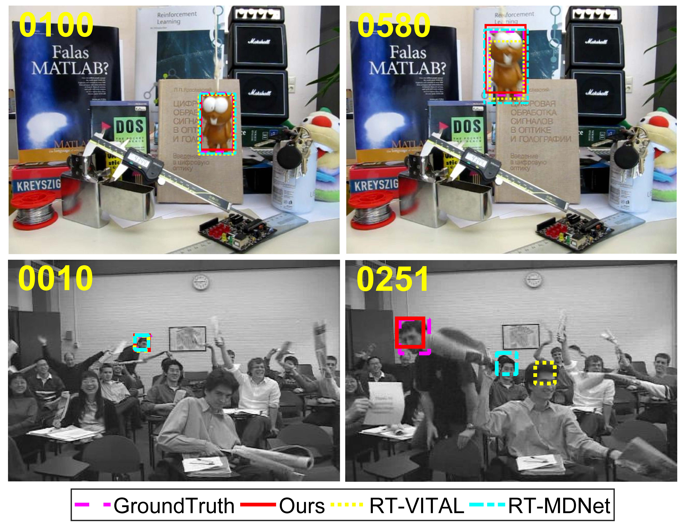

# impr-RT-VITAL: Improved Real-Time Tracking via Adversarial Learning

Created by Haoxiang Zhong.

## Introduction
Improved RT-VITAL is deep learning based tracking algorithm. And our work is greatly inspired by [RT-MDNet](https://github.com/IlchaeJung/RT-MDNet) as well as [VITAL](https://github.com/ybsong00/Vital_release).  
The pipeline of this tracker is based on [RT-MDNet](https://github.com/IlchaeJung/RT-MDNet).

## System Requirements

This code is tested on 64 bit Linux (Ubuntu 16.04 LTS).

### Prerequisites 
  0. Python 2.7 (other versions of Python2 may also work)
  1. PyTorch (>= 0.2.1)
  2. For GPU support, a GPU (~2GB memory for test) and CUDA toolkit.
  3. Training Dataset (ImageNet-Vid) if needed.
  4. Testing Dataset (e.g. OTB100, GOT-10k, ...)

  
## Online Tracking

### Pretrained Model
Our work only modifies the tracker during online tracking. Pretrained model is provided by [RT-MDNet](https://github.com/IlchaeJung/RT-MDNet) at: [RT-MDNet-ImageNet-pretrained](https://www.dropbox.com/s/lr8uft05zlo21an/rt-mdnet.pth?dl=0).

Other crucial models or files from our work is provided here: [Baidu Yun](https://pan.baidu.com/s/1Iwz-PeCDU04mALwgWwvlwg), extraction code:`en3j`.  

Of all the models `rt-mdnet.pth` and `G_sample_list_2.mat` are crucial, other files can be generated during running the code.  
If you want to save your time, `g_model0.003.pth` may also be downloaded.  
Downloading `feat_*.npy` will save your time during feature extraction while pretraining net G.

Please put all the files and models in `./models/`
### Test
    python2 Run.py  #Run the trakcer, and it will save a pickle file at ./result
    cd ./result
    python save_txt.py   #Decode the pickle file into txt files
We **do not** recommend test our tracker on VOT benchmark, because these data are used for model learning during initialization.      

### Learning RT-MDNet
Please refer to [RT-MDNet](https://github.com/IlchaeJung/RT-MDNet)  for more details on traning.
  
